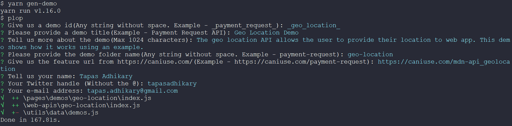

# 🏗️ How to add a demo to the playground

This `how-to` guide will help you create a demo and add it to the WebAPIS Playground repository with a few simple steps.

## 1. Prerequisites

We assume you have `forked` the repository and `cloned` it locally. As prerequisites, please make sure you have installed all dependencies using,

```shell
npm install # Or yarn install
```

Also, you can launch the playground locally using,

```shell
npm run dev # Or yarn dev
```

By default, the playground is running on port 3000.

## 2. Add and Assign an issue

Next, please check if [there is an existing issue/feature request](https://github.com/atapas/webapis-playground/issues) available for your demo. Also, make sure it is not owned by anyone else. Please assign the issue to yourself.

If you do not find an existing issue, please [create a new one](https://github.com/atapas/webapis-playground/issues/new/choose) and assign it to yourself.

## 3. Create a branch

Would you please create a branch for the issue? The branch name should be `demo-<issue-number>-<some-text-about-it>`. For example, if the issue number is `14`, the branch name should be `demo-14-geo-location`. Now switch to the branch and start working on the demo.

## 4. Add a demo

Please open a command-line tool and run the following command from the root of the project,

```shell
npm run gen-demo # Or yarn gen-demo
```

Now you will be asked to give answers to a few questions.

- **Give us a demo id**: This is the id of the demo that you want to add. Please provide a unique id, preferably in this format, `_payment_request`(assuming you are adding a demo for the Payment Request API).
- **Please provide a demo title**: This is the title of the demo that you want to add.
- **Tell us more about the demo**: This is the description of the demo that you want to add.
- **Please provide the demo folder name**: This is the folder name of the demo that you want to add. Please provide a folder name, preferably in this format, `payment-request`(assuming you are adding a demo for the Payment Request API).
- **Give us the feature URL from https://caniuse.com/**: This is the feature URL of the demo that you want to add. Would you please provide a feature URL, preferably in this format, `https://caniuse.com/payment-request`(assuming you are adding a demo for the Payment Request API)?
- **Tell us your name:** This is the name of the author of the demo you want to add. Please provide a name.
- **Your Twitter handle:** This is the Twitter handle of the author of the demo that you want to add. Please provide a Twitter handle without the `@` symbol.
- **Your e-mail address:** This is the email of the author of the demo that you want to add. Please provide an email.

> Here is a screenshot of the process: 

## 5. Autogenerating the code for the demo

The above process will automatically generate the code for the demo to start with.

- **The code will be generated in the `pages/demos` folder**: You will see a new folder created for your demo with a file called `index.js`. This file will contain the user interface code for your demo. Please write the UI code in the `ToRender` component.

- **The Web API logic to go to `web-apis` folder**: You will see a new folder created under the `web-apis` folder with a file named `index.js`. This file will contain all the logic for your demo. Your logic should be exported as functions in the UI component(under `pages/demos` folder) we discussed above.

- **The `isSupported()` method**: It is important to define the browser support for an API in the `isSupported()` method of your API file. Please check the [MDN documentation](https://developer.mozilla.org/en-US/docs/Web/API) for the support logic for the API you are adding.

## 6. Complete Demo Coding and Create Pull Request(PR)

Once done, please create a Pull Request following the Pull Request template. Once you create a PR, you will get a deployable demo link created for you, and you will be able to see the demo in the playground. Please verify it before you mark the PR work as done.

Got an an issue? Please [start a discussion](https://github.com/atapas/webapis-playground/discussions/new) or contact [the maintainer](https://twitter.com/tapasadhikary) for help.

# What happens when your Pull Request is Merged?

Hurray!!! You are a proud contributor to the WebAPIS Playground. Congratulations 👏. We can't wait to talk about it publicly. We share your demo to social media like Twitter, Linked In, and a few other places. We also add you to our [Contributors](https://github.com/atapas/webapis-playground#contributors-) list.

Please feel free to write about your contributions on [Hashnode](https://hashnode.com/), [dev](http://dev.to/), [devdojo](https://devdojo.com/) or any other blogging platform. Do you want to make a video and upload it to youtube? You are most welcome. Please share the link with us to help us promote the WebAPIS Playground work.

So, why waiting? Happy Coding & Happy Contributing 🙂!!!
